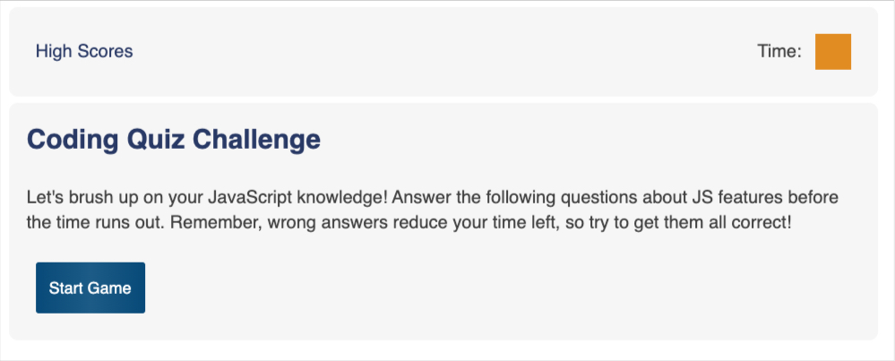
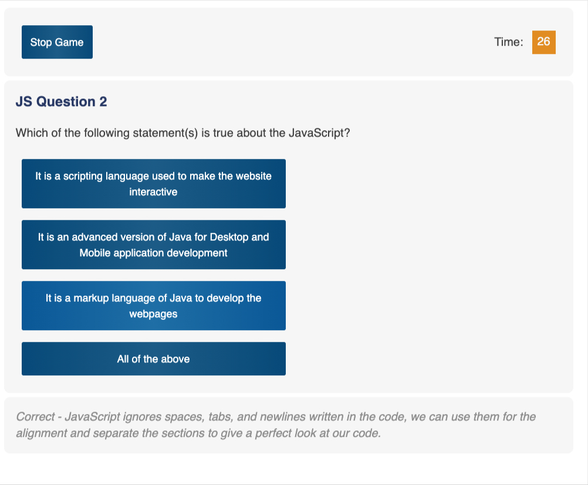

# JavaScript Quiz Game

## Description

This project, for the user, is a trivia game to help a fledgling web developer brush up on JavaScript facts before in preparation for an interview.  For the developer, this project is an opportunity to put many aspects of HTML, CSS and JavaScript to use. 

I tried to make the game interface as intuitive as possible: start game, select an answer, get feeedback on if the answer was correct, and at the end of the game, enter initials and see high scores.  I made the game have a set of ten JS related questions.  At each reload of the game, the questions are shuffled and five questions are selected at random.  Also, I set the scoring function to automatically sort the scores in desending order, and limit the stored scores to five entries.  

## Lessons Learned

This has been my most challenging project to date.  I had to build the entire application's structure, styling, and interactive elements.  Some of the functionality came together quite quickly, such as the array of questions, each of which is an object.  Setting and getting local storage came together quickly.  I had a surprising amount of difficulty with getting the setIntervals to work properly, to set the timer, stop it under a few conditions, and pass the timer's value to another element on the page, and subsequently to a score object.  

Initially, I was able to iterate all of the questions at once, then tried to toggle display across the array, but feedback from my instructor and classmates pointed me in the direction of holding the questions as an array, and iterating them one at a time, as the user answers each question.  Also, at first I tried creating all the content, including containing `div` elements dynamically, but changed to having the containing elements on the page, and using JavaScript to insert content into them.

For this project, I am very satisfied to have it working appropriately, with clean, responsive styling. I would like to revisit this code at some point to see if I can refactor it to be less verbose.

## Features
* Question shuffling 
* Timer style changes when an incorrect answer is selected (for two seconds) and also when only 5 seconds remain
* Non-active sections of the page are made invisible at appropriate times
* Stored scores display on the high scores page and persist in local storage
* Styling is responsive without the use of Bootstrap or other libraries
* When the user selects an answer, a validation message along with an explanation appears below the next question to offer feedback

## Deployment
The game is deployed here for use:
[https://mikewebprint.github.io/js-quiz-game/](https://mikewebprint.github.io/js-quiz-game/)

## Credits

I did this project on my own, but am grateful for feedback from my instructor Kris Renaldi, as well as several classmates. I did rely on a few solutions to individual problems.

Questions came from [https://www.includehelp.com/mcq/javascript-multiple-choice-questions-mcqs.aspx](https://www.includehelp.com/mcq/javascript-multiple-choice-questions-mcqs.aspx)

The function to randomize the questions was found here:
[https://stackoverflow.com/questions/2450954/how-to-randomize-shuffle-a-javascript-array](https://stackoverflow.com/questions/2450954/how-to-randomize-shuffle-a-javascript-array)

I used this developer's timer as a starting point:
[https://stackoverflow.com/questions/1191865/code-for-a-simple-javascript-countdown-timer](https://stackoverflow.com/questions/1191865/code-for-a-simple-javascript-countdown-timer)
