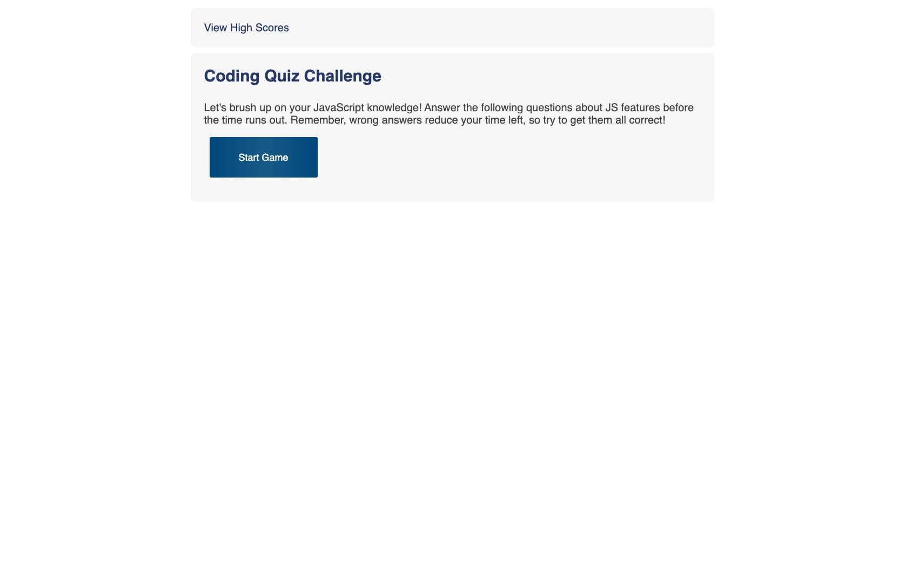
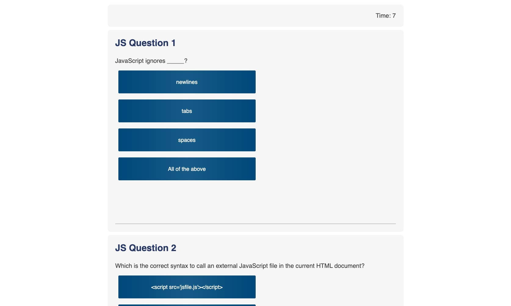
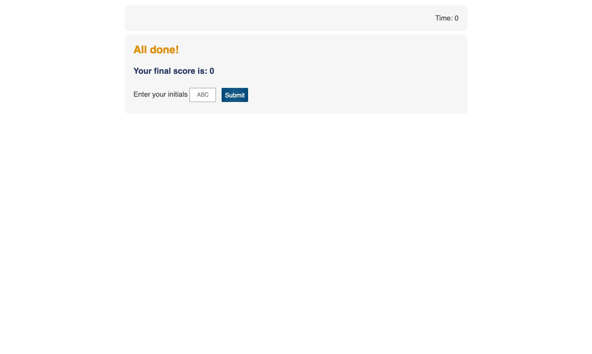
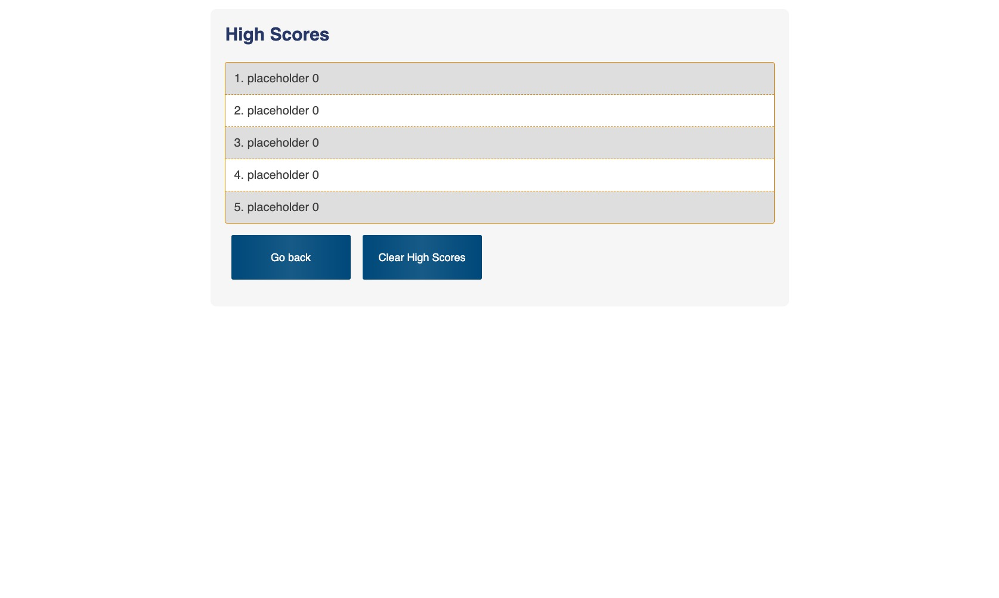

# JavaScript Quiz Game

## Description

This project, for the user, is a trivia game to help a fledgling web developer brush up on JavaScript facts before in preparation for an interview.  For the developer, this project is an opportunity to put many aspects of HTML, CSS and JavaScript to use. 

I tried to make the game interface as intuitive as possible: start game, select an answer, get feeedback on if the answer was correct, and at the end of the game, enter initials and see high scores.  I made the game have a set of ten JS related questions.  At each reload of the game, the qeustions are shuffled and five questions are selected at random.  Also, I set the scoring function to automatically sort the scores in desending order, and limit the stored scores to five entries.  

What works:
* Question shuffling 
* Timer starts, displays on the page and stops at 0
* Non-active sections of the page are made invisible at appropriate times
* Stored scores display on the high scores page
* Styling is clean and responsive without the use of Bootstrap or other libraries

What doesn't work:
* Only having one question display at a time.  I was able to display the first question, but have not yet been able to pass to subsequent questions, so I toggled that function off.
* Displaying an answer explanation when an answer is clicked.  I had some of this functionality working, including an alert to indicate correct/incorrect answers, but incompletely, and at submission I am in the process of refactoring.
* Clearing interval (timer) when the last question is answered
* User initials and scores being passed properly. I know that the set score sorting function works when I set user and score values manually, but passing them on form submission is just not working.  The values are there, but being passed as empty strings.

Provide a short description explaining the what, why, and how of your project. Use the following questions as a guide:

- What was your motivation?
- Why did you build this project? (Note: the answer is not "Because it was a homework assignment.")
- What problem does it solve?
- What did you learn?

## Table of Contents (Optional)

## Installation

What are the steps required to install your project? Provide a step-by-step description of how to get the development environment running.

## Usage

Provide instructions and examples for use. Include screenshots as needed.

The game is deployed here for use, such as it is:
[https://mikewebprint.github.io/js-quiz-game/](https://mikewebprint.github.io/js-quiz-game/)

To add a screenshot, create an `assets/images` folder in your repository and upload your screenshot to it. Then, using the relative filepath, add it to your README using the following syntax:

## Credits

I did this project on my own, but am grateful for feedback from my instructor Kris Renaldi, as well as several classmates. I did rely on a few solutions to individual problems.
Questions came from [https://www.includehelp.com/mcq/javascript-multiple-choice-questions-mcqs.aspx](https://www.includehelp.com/mcq/javascript-multiple-choice-questions-mcqs.aspx)
The function to randomize the questions was found here:
[https://stackoverflow.com/questions/2450954/how-to-randomize-shuffle-a-javascript-array](https://stackoverflow.com/questions/2450954/how-to-randomize-shuffle-a-javascript-array)
I did use this site's timer as a starting point, though I expect to refactor it:
[https://stackoverflow.com/questions/1191865/code-for-a-simple-javascript-countdown-timer](https://stackoverflow.com/questions/1191865/code-for-a-simple-javascript-countdown-timer)
